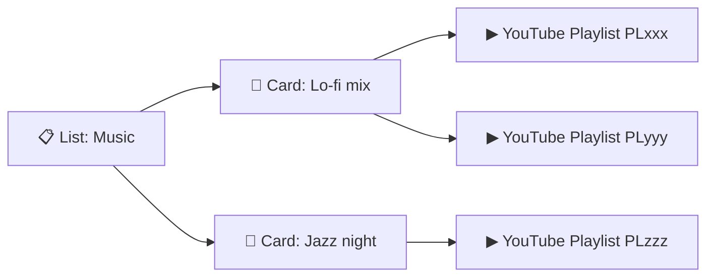

<div align="center">

# 🎲 PLAYLISTS RANDOMIZER

### Shuffle YouTube playlists in your browser — no account, no server, no install required.

<br>

[](https://alexrabbit.github.io/Playlists-Randomizer/)
[](#-license)
[](https://www.typescriptlang.org/)
[](https://vitejs.dev/)

**Bookmark one URL → your entire music workspace comes back later.**

[🚀 Try it now](#-try-it-in-30-seconds-zero-install) · [📖 Full tutorial](#-complete-beginner-tutorial-step-by-step) · [✨ Features](#-feature-showcase) · [❓ FAQ](#-faq--troubleshooting)

</div>

---

## 🤔 What is this?

**Playlists Randomizer** is a free web app that lets you:

1. **Paste YouTube playlist links** (one or many)
2. **Press play** and hear videos in **random order** (or sequential)
3. **Organize** everything into **Lists** and **Cards** — like folders and players
4. **Save everything** by **bookmarking the page** (no login needed)

> **Think of it like:** Spotify shuffle, but for *your* YouTube playlists — and you control the layout.

**You do NOT need to:**
- Create an account
- Install anything (if you use the live website)
- Pay for hosting
- Trust a server with your data — it all stays in **your browser**

---

## 🗺️ Screen map (where is everything?)

When you open the app, you see **four zones**:

```
┌─────────────────────────────────────────────────────────────────────────────┐
│  TOP BAR          PLAYLISTS RANDOMIZER          [Language] [🔬 Logs]          │
├──────────────┬──────────────────────────────────────────────┬───────────────┤
│              │                                              │               │
│  LEFT        │           MAIN AREA (center)                   │  RIGHT        │
│  (optional)  │                                              │  SIDEBAR      │
│              │   Your List name + [Search] [Add Card]         │               │
│  Playlist    │                                              │  📋 LISTS     │
│  panel       │   ┌─────────┐  ┌─────────┐  ┌─────────┐       │  + New list   │
│  opens when  │   │ Card 1  │  │ Card 2  │  │ Card 3  │       │  ─────────    │
│  you turn    │   │ ▶ player│  │ ▶ player│  │ ▶ player│       │  • ASMR       │
│  "Show       │   └─────────┘  └─────────┘  └─────────┘       │  • Music      │
│  video" ON   │                                              │  ─────────    │
│              │                                              │  Import/Export│
│              │                                              │  Settings     │
├──────────────┴──────────────────────────────────────────────┴───────────────┤
│  BOTTOM (optional)  Global player bar when you "Play all" a list            │
└─────────────────────────────────────────────────────────────────────────────┘
```

### The 3 concepts (learn these once)

| Concept | Plain English | Example |
|--------|----------------|---------|
| **List** | A folder / category | `ASMR`, `Workout`, `Chill` |
| **Card** | One player inside a list | `Rain sounds mix` — holds 1+ YouTube playlists |
| **Workspace** | Everything together | All your lists, cards, settings — saved in the URL |



---

## ⚡ Try it in 30 seconds (zero install)

1. Open the live app: **[alexrabbit.github.io/Playlists-Randomizer](https://alexrabbit.github.io/Playlists-Randomizer/)**
2. On the **right**, type a list name (e.g. `Test`) → click **`+`**
3. In the **center**, type a card name → click **`+ Add Card`**
4. Click **`Edit playlists`** on the card
5. Paste a **public** YouTube playlist URL, for example:
   ```
   https://www.youtube.com/playlist?list=PLrAXtmRdnEQy6nuLMHjMZ6s3fKjTjJ4T
   ```
6. Click **`Save & Play`**
7. Press **▶ Play**

🎉 You are now listening to a shuffled playlist.

---

## 📖 Complete beginner tutorial (step by step)

<details open>
<summary><strong>Step 1 — Open the app</strong></summary>

<br>

- **Easiest:** use the [live GitHub Pages link](https://alexrabbit.github.io/Playlists-Randomizer/)
- **On your computer (developers):** see [Run locally](#-for-developers-run-on-your-computer) below

You need a modern browser: **Chrome**, **Firefox**, **Edge**, or **Safari**.

</details>

<details>
<summary><strong>Step 2 — Create your first List (right sidebar)</strong></summary>

<br>

1. Look at the **right panel** — header says **LISTS**
2. Type a name in the box (e.g. `Relax`, `Gym`, `Study`)
3. Click the red **`+`** button
4. Your list appears below — click it to select it

**Tips:**
- **Double-click** a list name to rename it
- Drag the **⠿** handle to reorder lists
- **Right-click** a list → plays all cards in that list

</details>

<details>
<summary><strong>Step 3 — Add a Card (center area)</strong></summary>

<br>

1. With a list selected, find **"+ Add Card"** at the top of the center
2. Type a card name (e.g. `Ocean sounds`, `80s hits`)
3. Click **Add Card**

A **card** is one player. Each card can load **multiple YouTube playlists** and merge them into one shuffle queue.

</details>

<details>
<summary><strong>Step 4 — Add YouTube playlists to the card</strong></summary>

<br>

1. On the card, open the **⋮** menu → **Edit playlists**  
   *(or use the edit control on the card)*
2. In the text box, paste playlist URLs or IDs — **one per line**

**All of these work:**

```
https://www.youtube.com/playlist?list=PLxxxxxxxx
https://youtube.com/playlist?list=PLxxxxxxxx
PLxxxxxxxx
```

3. Click **Save & Play**

The app fetches video titles and builds your queue. The first video loads automatically.

**Bulk paste:** use **Bulk paste playlists** to dump many URLs at once (comma, semicolon, or newline separated).

</details>

<details>
<summary><strong>Step 5 — Use the player controls</strong></summary>

<br>

Each card has two rows of controls:

| Button | What it does |
|--------|----------------|
| **⏮ Prev** | Previous video in queue |
| **▶ / ⏸** | Play or pause |
| **⏭ Next** | Next video |
| **🔊 Volume** | Volume slider |
| **Random / Sequential** | Shuffle order vs playlist order |
| **Show video** | Toggle video on/off (audio-only mode) |
| **Autoplay next** | Auto-advance when a video ends |
| **🔍 Search** | Find a video by title in this card's queue |

**Seek bar:** drag to jump inside the current video.

</details>

<details>
<summary><strong>Step 6 — Open the playlist sidebar (left panel)</strong></summary>

<br>

1. Turn **Show video** **ON** on a card
2. The **left panel** slides in — same glass style as the right sidebar
3. You see:
   - **Now playing** — pinned at top (stays visible while you scroll)
   - **Full queue** — click any row to jump to that video
   - **⠿ Drag handle** — drag rows to reorder the queue
   - **Badges** — `Deleted`, `Private`, `Unavailable` on broken videos (auto-skipped on play)
   - **Load full playlist** — footer button if YouTube only returned part of the list

Turn **Show video** **OFF** → left panel closes.

</details>

<details>
<summary><strong>Step 7 — Save your work (IMPORTANT)</strong></summary>

<br>

**Everything lives in the browser URL.** No cloud account.

### Option A — Bookmark (recommended)

1. Right sidebar → **Copy bookmark URL** (or drag **★ Drag to Bookmarks**)
2. Save as a browser bookmark
3. Next time: open that bookmark → your lists, cards, and settings return

### Option B — Export backup file

1. Right sidebar → **Export backup**
2. A `.json` file downloads to your computer
3. **Import backup** restores it later (or on another device)

> ⚠️ If you close the tab **without** bookmarking or exporting, unsaved work may be lost.

</details>

<details>
<summary><strong>Step 8 — Search across a whole list</strong></summary>

<br>

1. Select a list
2. Click **🔍 Search** in the center header
3. Type **3+ characters** of a video title
4. Click a result → the focused card jumps to that video

</details>

<details>
<summary><strong>Step 9 — Optional: YouTube API key (full playlists)</strong></summary>

<br>

Without an API key, YouTube limits how many videos load per playlist (~**200** via Innertube, sometimes less).

**To load complete playlists:**

1. [Google Cloud Console](https://console.cloud.google.com/) → enable **YouTube Data API v3** → create an API key
2. In the app: right sidebar → **Settings** → paste key → **Save**
3. The key is stored in **your bookmark URL** (client-side only)

Or click **Load full playlist** on a card / in the left sidebar after a truncated load.

</details>

---

## ✨ Feature showcase

<table>
<tr>
<td width="50%">

### 🎲 Smart shuffle
- **Random** (default) — fresh shuffle per card
- **Sequential** — original playlist order
- Merge **multiple playlists** into one queue

### 🎧 Audio-first mode
- **Show video OFF** — listen without the video player
- Smaller footprint, less distraction
- Perfect for music & ambient

### 📋 Left playlist panel
- Opens with **Show video**
- **Now playing** pinned row
- **Drag-to-reorder** queue
- Click any track to jump

</td>
<td width="50%">

### 🔖 URL = your save file
- Full workspace in `?ws=` or `#ws=`
- LZ-compressed — shareable links
- Legacy `?pid=PLxxx` URLs still work

### 💾 Import / Export
- JSON backups with version header
- Move between browsers/devices
- No vendor lock-in

### 🪟 Glass dark UI
- Frosted glass panels
- Red accent focus glow
- Skeleton loaders, tooltips, haptics
- Segmented Random/Sequential control

</td>
</tr>
<tr>
<td>

### 🛡️ Resilient playback
- Auto-skip **deleted / private** videos
- Badges on unavailable rows
- Debug **Logs** panel (top bar 🔬)

</td>
<td>

### 🌍 Global list player
- **Play all** on a list (right-click list or ▶)
- Bottom **global player** bar
- Keeps playing while you browse cards

</td>
</tr>
</table>

---

### Control cheat sheet

| I want to… | Do this |
|------------|---------|
| Shuffle my playlists | Add playlists to a card → leave **Random** on → Play |
| Listen without video | Turn **Show video** off |
| See the full queue | Turn **Show video** on → left panel opens |
| Reorder what's next | Drag **⠿** in the left panel |
| Save everything | **Copy bookmark URL** or **Export backup** |
| Load more than ~200 videos | Add **YouTube API key** in Settings |
| Fix a stuck playlist | **Load full playlist** or add API key |
| Find one song | **Search** on card or list |
| Organize categories | Create **Lists**, drag to reorder |
| Multiple players per category | Add multiple **Cards** per list |

---

## 🔒 Privacy & data

| Question | Answer |
|----------|--------|
| Where is my data stored? | In the **URL** (bookmark) and **browser memory** — not on our server |
| Is there a backend? | **No.** Static site on GitHub Pages |
| What leaves my browser? | Requests to **YouTube** to load playlist metadata and play videos |
| API key safety? | Stored in your URL if you add one — **don't share that bookmark publicly** if it contains a key |

---

## 🛠️ For developers: run on your computer

### Requirements
- [Node.js](https://nodejs.org/) **18+** (22 recommended)
- npm (comes with Node)

### Windows quick start

```bat
run.bat
```

### Manual

```bash
git clone https://github.com/AlexRabbit/Playlists-Randomizer.git
cd Playlists-Randomizer
npm install
npm run dev
```

Open: `http://localhost:5173/Playlists-Randomizer/`

### Scripts

| Command | Purpose |
|---------|---------|
| `npm run dev` | Development server with hot reload |
| `npm run build` | Typecheck + production build → `dist/` |
| `npm run preview` | Preview production build locally |
| `npm test` | Run unit tests |
| `npm run lint` | TypeScript check only |

### Configuration

Copy `.env.example` → `.env`:

| Variable | Default | Description |
|----------|---------|-------------|
| `VITE_BASE_PATH` | `/Playlists-Randomizer/` | Asset path for GitHub Pages |
| `VITE_DEFAULT_RANDOM` | `true` | New cards shuffle by default |
| `VITE_DEFAULT_SHOW_VIDEO` | `false` | Start in audio-only mode |
| `VITE_LEGACY_PID_COMPAT` | `true` | Import old `?pid=` links |

See also: [`docs/DEPLOY.md`](docs/DEPLOY.md) for GitHub Pages deployment.

### Project layout

```
src/
  app/       # State store, toasts
  core/      # Models, URL codec, YouTube fetch, cache, backup
  ui/        # Glass components, styles, icons
  i18n/      # Translations (English included)
  logs/      # In-app debug logger
tests/       # Vitest unit tests
public/      # Fonts & static assets
```

---

## ❓ FAQ & troubleshooting

<details>
<summary><strong>Nothing plays / "No videos"</strong></summary>

<br>

- Playlist must be **public** (not private/unlisted-only)
- Check URLs are correct `playlist?list=PL...` format
- Try **Load full playlist** or add a **YouTube API key**
- Open **🔬 Logs** (top bar) for error details

</details>

<details>
<summary><strong>Only ~15–200 videos loaded</strong></summary>

<br>

YouTube limits anonymous fetches. Fixes:

1. **Settings** → paste **YouTube Data API v3** key → Save  
2. Or click **Load full playlist** after load

</details>

<details>
<summary><strong>My bookmark URL is huge</strong></summary>

<br>

Normal for big workspaces. The app uses compression (`lz-string`). Very large workspaces move data to `#ws=` in the hash to keep the link manageable.

</details>

<details>
<summary><strong>Video says Deleted / Private</strong></summary>

<br>

The app labels it, auto-skips on playback, and continues to the next playable video.

</details>

<details>
<summary><strong>Blank page after deploy</strong></summary>

<br>

`VITE_BASE_PATH` must match your repo name, e.g. `/Playlists-Randomizer/`. See [`docs/DEPLOY.md`](docs/DEPLOY.md).

</details>

<details>
<summary><strong>Can I use this on phone?</strong></summary>

<br>

Yes — the layout adapts. Sidebars stack on narrow screens. For best experience, bookmark on mobile Safari/Chrome.

</details>

---

## 🤝 Contributing

Issues and PRs welcome. Please run `npm test` before submitting.

---

## 📄 License

MIT — use freely, modify, ship your own version.

---

<div align="center">

**Made for people who want YouTube playlists — shuffled, organized, and saved in a bookmark.**

⭐ Star the repo if it helped you · [Report a bug](https://github.com/AlexRabbit/Playlists-Randomizer/issues)

</div>
